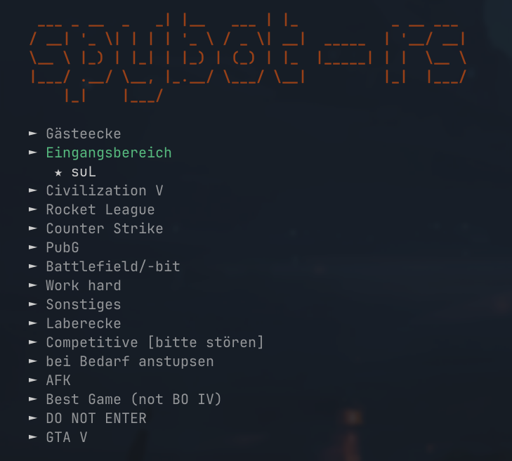

# spybot-rs

A small CLI for the [Spybot](https://github.com/SmoFlaDru/Spybot2) Teamspeak server monitoring and statistics system. To fetch the current Teamspeak channels and clients.



## Requirements

- Rustup toolchain

## Install

1. Clone the repository
2. Run cargo install

```bash
$ cargo install --path .
```

## Usage

```bash
$ spybot

     ___ _ __  _   _| |__   ___ | |_           _ __ ___
    / __| '_ \| | | | '_ \ / _ \| __|  _____  | '__/ __|
    \__ \ |_) | |_| | |_) | (_) | |_  |_____| | |  \__ \
    |___/ .__/ \__, |_.__/ \___/ \__|         |_|  |___/
        |_|    |___/

    ► Gästeecke
    ► Eingangsbereich
    ► Civilization V
    ► Rocket League
    ► Counter Strike
    ► PubG
    ► Battlefield/-bit
    ► Work hard
    ► Sonstiges
    ► Laberecke
    ► Competitive [bitte stören]
    ► bei Bedarf anstupsen
    ► AFK
    ► Best Game (not BO IV)
    ► DO NOT ENTER
    ► GTA V
```
